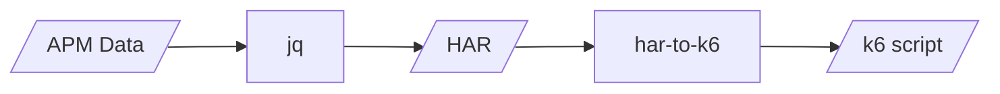

This project was initially to built out a load testing tool based off Elastic APM data, being able to replay requests taken directly from Elastic APM (and in future, other sources).

After working on this tooling, it made more sense to take advantage of existing tools such as [k6](https://k6.io), specifically their [har-to-k6](https://github.com/grafana/har-to-k6) converter.

This project pivoted to become documentation and examples of how to transform your Elastic APM data into a k6 script by converting it to a [HAR](www.softwareishard.com/blog/har-12-spec) file via [jq](https://jqlang.github.io/jq/) and finally into a k6 script via [har-to-k6](https://github.com/grafana/har-to-k6).

More documentation to come, but for now, the basic instructions are:

1. Export transaction APM data into JSON
2. `APM_DATA_FILE=apm-data.json`
3. `HAR_DESTINATION_FILE=apm-data.har`
4. `K6_DESTINATION_FILE=k6-script.js`
5. `cat $APM_DATA_FILE | jq '{ log: { version: "1.2", creator: { name: "Your Name", version: "1.0" }, entries: [ .[] | { startedDateTime: .["@timestamp"], time: 0, request: { method: .http.request.method, url: .request, httpVersion: "HTTP/1.1", cookies: [], headers: .http.request.headers | to_entries | map(.name = .key | del(.key)), queryString: [], headersSize: 0, bodySize: 0 }, response: { status: .status, statusText: "OK", httpVersion: "HTTP/1.1", cookies: [], headers: [], content: { size: .bytes, mimeType: "application/octet-stream" }, redirectURL: "", headersSize: 0, bodySize: 0 }, cache: {}, timings: { blocked: 0, dns: -1, connect: -1, send: 0, wait: 0, receive: 0, ssl: -1 }, serverIPAddress: .host, connection: "", comment: "" } ] } }' > $HAR_DESTINATION_FILE`
6. `npx har-to-k6 $HAR_DESTINATION_FILE -o $K6_DESTINATION_FILE`

# Philosophy

- **Use the appropriate tools.** Choice of languages or dependencies should be chosen to achieve the goals of the project, not based on personal preference.
- **Stability.**
- **Performance.**
- **Generic.** Input & Output should be generic and as vast as possible. E.g input should be CSV, JSON, TOML etc
- **Respect users resources.** Should use the minimum resources possible. Given the user the ability to customise this where appropriate.
- **Leveled logging.**

# Appropriate Tools

The language that is used should have perform well on the following metrics, which should be measured whilst testing each language, in the fairest way possible.

- **Jitter.** The smallest jitter between the set delay and the execution of the function. E.g setting a delay of 100ms, executing the function 100ms after setting that delay is perfect.
- **High volume.** Being able to handle sending a huge volume of requests in a short time frame.
- **Resource usage.** Using a smaller amount of resources to run the application is better
- **Concurrency.** Being able to perform workloads without affecting the timing of the application is important for progressive scheduling.

## TODO

- [] Measure memory usage
- [] Measure CPU usage
- [] Evaluate against HTTPS nginx
- [] Generate larger test data for Rust
- [] Write Go implementation
- [] Graph jitter results

## Running evaluation

This tool has been written in 4 (to be 5) different languages and/or runtimes. Each with it's own `Dockerfile`.

You will not see output until the end of the evaluation, you can turn on Nginx logging by enabling `access_log` in `scripts/bin-web-app/server.conf`.

There are two ways to run these evaluations.

### Locally via Docker Compose

For development purposes you may want to run these evaluations locally, there is a provided `docker-compose.yaml` that handles this. Ensure that `docker-compose.yaml` is pointing to the `Dockerfile` you want and then run `docker compose up --build`, this will automatically generate test data and run the evaluation against the specified `Dockerfile`.

### GitHub Actions

There is a GitHub workflow file per language/runtime. These are triggred when the `main` branch is updated and their respective folder, or the workflows folder, is updated. This is to prevent running needless tests.

Each workflow can also be ran manually.

All job summaries will be consistent so comparing results across all languages/runtimes is trivial.

The workflows do generate fake data slightly differently to how it's done via `docker compose` locally, however it should have no impact on the performance of the test.

Local results should not be compared to results from GitHub actions due to hardware differences.

## Evaulation Results

All tests ran with no logging other than start/end.

100 Requests over 5 minutes

- Deno 1.39
    - Jitter
        - Average: 0.88ms
        - Minimum: -1ms
        - Maximum: 6ms
- Node.js 20.5.1
    - Jitter
        - Average: 0.12ms
        - Minimum: -3ms
        - Maximum: 16ms
- Rust 1.67 (Tokio)
    - Jitter
        - Average: 1.23ms
        - Minimum: 0.07ms
        - Maximum: 2.42ms

1000 Requests over 5 minutes

- Deno 1.39
    - Jitter
        - Average: 0.72ms
        - Minimum: 0ms
        - Maximum: 7ms
- Node.js 20.5.1
    - Jitter
        - Average: -2.362ms
        - Minimum: -7ms
        - Maximum: 8ms
- Rust 1.67 (Tokio)
    - Jitter
        - Average: 1.27ms
        - Minimum: 0.17ms
        - Maximum: 110.74ms

10000 Requests over 5 minutes

- Deno 1.39
    - Jitter
        - Average: -2.3642ms
        - Minimum: -7ms
        - Maximum: 35ms
- Node.js 20.5.1
    - Jitter
        - Average: 0.5965ms
        - Minimum: -2ms
        - Maximum: 26ms
- Rust 1.67 (Tokio)
    - Jitter
        - Average: 1.13ms
        - Minimum: 0.01ms
        - Maximum: 18.91ms

100000 Requests over 5 minutes

- Deno 1.39
    - Jitter
        - Average: 0.37269ms
        - Minimum: -3ms
        - Maximum: 436ms
- Node.js 20.5.1
    - Jitter
        - Average: 0.14702ms
        - Minimum: -4ms
        - Maximum: 372ms
- Rust 1.67 (Tokio)
    - Jitter
        - Average: 1.05ms
        - Minimum: 0.007ms
        - Maximum: 3.05ms